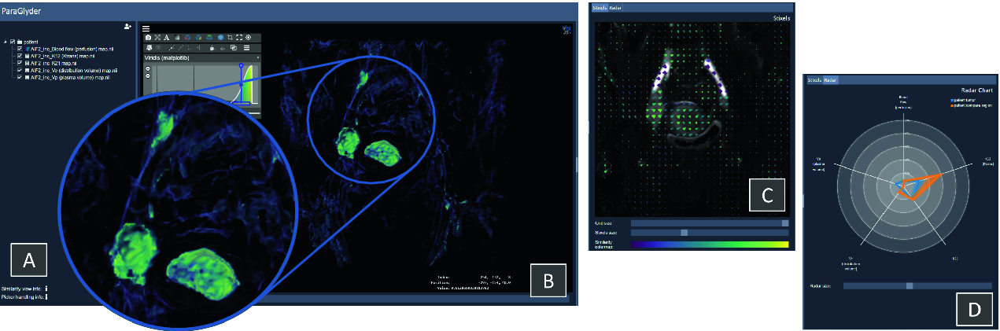

# ParaGlyder: Probe-driven Interactive Visual Analysis for Multiparametric Medical Imaging Data

####Eric Mörth, Ingfrid S. Haldorsen, Stefan Bruckner and Noeska N. Smit

####Abstract:
Multiparametric imaging in cancer has been shown to be useful for tumor detection and may also depict functional tumor characteristics relevant for clinical phenotypes. However, when confronted with datasets consisting of multiple values per voxel, traditional reading of the imaging series fails to capture complicated patterns. These patterns of potentially important imaging properties of the parameter space may be critical for the analysis, but standard approaches do not deliver sufficient details. Therefore, in this paper, we present an approach that aims to enable the exploration and analysis of such multiparametric studies using an interactive visual analysis application to remedy the trade-offs between details in the value domain and in spatial resolution. This may aid in the discrimination between healthy and cancerous tissue and potentially highlight metastases that evolved from the primary tumor. We conducted an evaluation with eleven domain experts from different fields of research to confirm the utility of our approach.

Part of the Lecture Notes in Computer Science book series (LNCS, volume 12221)

https://doi.org/10.1007/978-3-030-61864-3_29

####Coding Resources:

Radar Chart design by: Nadieh Bremer (Inspired by the code of alangrafu) - www.visualcinnamon.com

VTK - The visualization Toolkit https://vtk.org/

ITK - The Insight Toolkit https://itk.org/

Partly based on vtl-itk-viewer https://kitware.github.io/itk-vtk-viewer/index.html

Programmatically changes the darkness of a color https://www.sitepoint.com/javascript-generate-lighter-darker-color/

D3 - Data-Driven Documents https://d3js.org/  

TreeView - jsTree jQuery tree Plugin https://www.jstree.com/

Layout - jQuery UI Layout http://layout.jquery-dev.com/